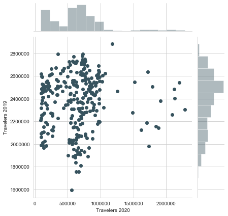
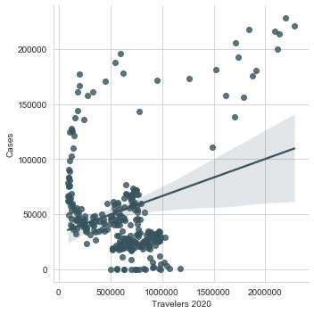
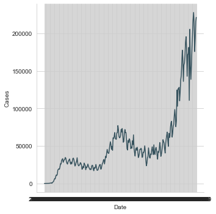
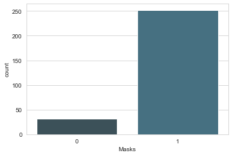
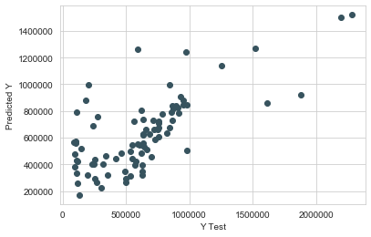
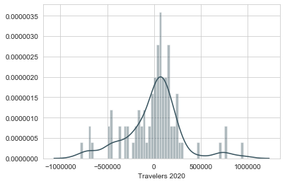

# Travel in 2020

The year 2020 has been filled with many different events that have impacted various commercial areas. Specifically, the travel industry in the United States has seen a significant down tick in the number of people traveling. The purpose of this project is to collect data from various different sources to see if we can predict with high accuracy the number of people that would travel on a single day in 2020, specifically flying. We will be using data for number of travelers from the TSA website, data from the ourworldindata.org for covid case counts per day, stock market data from yahoo finance, and various other sources to know dates of travel bans. We want to see if the economic status, public health status, sports status, or CDC guidelines can be used to predict with high accuracy the number of air travelers in the United States.

## Getting and Cleaning the Data

As stated in the beginning, the data was collected from tsa.gov, ourworldindata.org, yahoofinance.com, npr.com, nba.com, and cdc.gov. The data was imported into Excel using data connections and then converted to .csv files for ease of reading in the data. We had to filter the ourworldindata.org dataset to only show the United States. The data provided by ourworldindata.org, tsa.gov, and yahoofinance.com all were organized by year, month, day. We joined those dataframes on their 'Date' columns. After that, we dropped the unneccessary columns and renamed some others for ease later on. We then researched dates when the NBA shutdown and started back up and when the CDC started recommending that the public wear masks. We merged that information into the main dataframe to prepare for EDA.

## EDA

### Travelers 2020 vs Travelers 2019




As we can clearly see, the number for 2020 Travelers have been significantly smaller than from 2019


### Travelers 2020 vs Cases




Very interesting shape to this...  


### Number of Cases for United States in 2020




### Number of days within time range with and without mask recommendations




### Number of Travelers vs Number of Cases United States 2020


## Models

We fit our data to different machine learning models. We fit the data to a linear, KNN, ridge, and decision tree model. We ran MAE, MSE, RMSE, and CV scores as our metrics to determine which model had the highest predictive power.

### Linear Regression





### Linear Regression scores

MAE: 209582.34029446437

MSE: 89312463686.86139

RMSE: 298851.9092909754

R^2:  0.5075655165151798

Cross validation score:  279372589873.1498
    
With a RMSE of 298851 and CV score of 279372589873.1498, I would say that this model isn't the best for predicting the number of airplane travelers in 2020, but 2020 has been hard for anyone to predict so it's not the worst thing to come from 2020.

### Residual Plot



At least the residuals look normal? That's good? Our data really isn't that linear though, so linear regression assumptions are iffy on this data


## KNN

MAE: 317331.5046511628
MSE: 198213011157.18558
RMSE: 445211.19837351976
Cross validation score: 230145124472.75333

Well, this model did not do any better at predicting with accuracy the amount of travelers flying on a given day in 2020 since the RMSE is much higher than that of the lm model. Let's try to find a proper amount of K with GridSearch.


## Ridge

MAE: 211176.6644662734
MSE: 90417914812.4394
RMSE: 300695.7179815493
R^2:  0.5014704853003841
Cross validation score:  289037063937.7112

Comparing this model's RMSE and CV score to that of Linear regression and KNN, it is the middle man. It performed slightly worse than the Linear regression model and better than the KNN model.


## Decision Tree Regressor

MAE: 213498.91860465117
MSE: 158967825632.52325
RMSE: 398707.6944736874
R^2:  0.12351271172499989
Cross validation score:  233772587653.33438      

From the decision tree scores, it would be in 3rd in for in ranking our ML methods by predictive power.

# Conclusions

From our various models metrics, we see that could not find a model with very high predictive power. Nonetheless, the best performing model with regard to the metrics we measured was our linear regression model. Since our RMSE for linear regression is actually less than our standard deviation for travelers in 2020, it does have a bit of predictive power. We do recognize that our model could use more features to aid in its predictive power. Some possible features to improve the model would be airfare prices, number of flights, travel bans, etc. As well, we recognize that the United States is a very big country and each part of it has been experiencing different trials throughout the year. From the pandemic to civil unrest, predicting events this year has been tough. Not only that, but we saw from our EDA that there was a sharp up tick of travelers near the end of year. This could be from people traveling home to be with their families, even though cases were higher than when a lot of the country had many shutdowns. Nonetheless, using country states of economic status, public status, recreation status, and CDC guideline of masks, we were able to construct a machine learning model to predict the number of air travelers on a given day in the United States. 


```python

```
