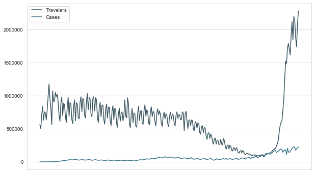

# Travel in 2020

The year 2020 has been filled with many different events that have impacted various commercial areas. Specifically, the travel industry in the United States has seen a significant down tick in the number of people traveling. The purpose of this project is to collect data from various different sources to see if we can predict with high accuracy the number of people that would travel on a single day in 2020, specifically flying. We will be using data for number of travelers from the TSA website, data from the ourworldindata.org for covid case counts per day, stock market data from yahoo finance, and various other sources to know dates of travel bans. We want to see if the economic status, public health status, sports status, or CDC guidelines can be used to predict with high accuracy the number of air travelers in the United States.

## Getting and Cleaning the Data

As stated in the beginning, the data was collected from tsa.gov, ourworldindata.org, yahoofinance.com, npr.com, nba.com, and cdc.gov. The data was imported into Excel using data connections and then converted to .csv files for ease of reading in the data. We had to filter the ourworldindata.org dataset to only show the United States. The data provided by ourworldindata.org, tsa.gov, and yahoofinance.com all were organized by year, month, day. We joined those dataframes on their 'Date' columns. After that, we dropped the unneccessary columns and renamed some others for ease later on. We then researched dates when the NBA shutdown and started back up and when the CDC started recommending that the public wear masks. We merged that information into the main dataframe to prepare for EDA.

## EDA

# Travelers 2020 vs Travelers 2019


As we can clearly see, the number for 2020 Travelers have been significantly smaller than from 2019


# Travelers 2020 vs Cases


Very interesting shape to this...  


# Number of Cases for United States in 2020


# Number of days within time range with and without mask recommendations


# Number of Travelers vs Number of Cases United States 2020




## Models

We will now fit our data to different machine learning models. We will be fitting the data to a linear, KNN, ridge, and decision tree model. We will run MAE, MSE, RMSE, and CV sc

## Linear Regression


```python
from sklearn.linear_model import LinearRegression
from sklearn.model_selection import train_test_split, cross_val_score
```


```python
#Separate response from explanatory
y = main_df['Travelers 2020']

X = main_df[['Cases', 'Deaths', 'Open', 'High', 'Low', 'Close', 'Adj Close', 'Volume', 'Sports', 'Masks', 'Travelers 2019']]
```


```python
#Separate training and test data
X_train, X_test, y_train, y_test = train_test_split(X, y, test_size=0.3, random_state=101)
```


```python
lm = LinearRegression()
```


```python
#Fit a linear regression model
lm.fit(X_train,y_train)
```


    LinearRegression(copy_X=True, fit_intercept=True, n_jobs=None, normalize=False)


```python
#Show coefficients
print('Coefficients: \n', lm.coef_)
```

    Coefficients: 
     [ 4.34770099e+00  1.83464093e+02  1.17004012e+02 -1.82928386e+02
      6.75991449e+01 -3.32849264e+00 -3.32849263e+00  5.09455846e-05
     -3.70770896e+05 -5.31593389e+05  2.44579269e-01]
    


```python
#Gather predictions from fitted model
predictions = lm.predict(X_test)
```


```python
#Plot predictions vs actual
plt.scatter(y_test,predictions)
plt.xlabel('Y Test')
plt.ylabel('Predicted Y')
```


    Text(0, 0.5, 'Predicted Y')


```python
#Generate metrics
from sklearn import metrics

print('MAE:', metrics.mean_absolute_error(y_test, predictions))
print('MSE:', metrics.mean_squared_error(y_test, predictions))
print('RMSE:', np.sqrt(metrics.mean_squared_error(y_test, predictions)))
print('R^2: ', metrics.r2_score(y_test, predictions))
```

    MAE: 209582.34029446437
    MSE: 89312463686.86139
    RMSE: 298851.9092909754
    R^2:  0.5075655165151798
    


```python
#CV score
print('Cross validation score: ',-1 * ((cross_val_score(lm, X, y, cv=10, scoring='neg_mean_squared_error')).mean()))
```

    Cross validation score:  279372589873.1498
    

With a RMSE of 298851 and CV score of 279372589873.1498, I would say that this model isn't the best for predicting the number of airplane travelers in 2020, but 2020 has been hard for anyone to predict so it's not the worst thing to come from 2020.


```python
#Plot residuals
sns.distplot((y_test-predictions),bins=60);
```


At least the residuals look normal? That's good? Our data really isn't that linear though, so linear regression assumptions are iffy on this data


```python
np.std(main_df['Travelers 2020'])
```


    400541.3894473091


## KNN


```python
from sklearn.neighbors import KNeighborsRegressor
```


```python
#KNN with 5
knn = KNeighborsRegressor(n_neighbors=5)
```


```python
#Fit the model
knn.fit(X_train, y_train)
```


    KNeighborsRegressor(algorithm='auto', leaf_size=30, metric='minkowski',
                        metric_params=None, n_jobs=None, n_neighbors=5, p=2,
                        weights='uniform')


```python
#Make predictions
knn_preds = knn.predict(X_test)
```


```python
#Get metrics
print('MAE:', metrics.mean_absolute_error(y_test, knn_preds))
print('MSE:', metrics.mean_squared_error(y_test, knn_preds))
print('RMSE:', np.sqrt(metrics.mean_squared_error(y_test, knn_preds)))
```

    MAE: 317331.5046511628
    MSE: 198213011157.18558
    RMSE: 445211.19837351976
    


```python
#Get CV score
print('Cross validation score: ',-1 * ((cross_val_score(knn, X, y, cv=10, scoring='neg_mean_squared_error')).mean()))
```

    Cross validation score:  230145124472.75333
    

Well, this model did not do any better at predicting with accuracy the amount of travelers flying on a given day in 2020 since the RMSE is much higher than that of the lm model. Let's try to find a proper amount of K with GridSearch.


```python
from sklearn.model_selection import GridSearchCV
```


```python
parameters = {'n_neighbors':list(range(1,30))}
knn = KNeighborsRegressor()
clf = GridSearchCV(knn, parameters)
clf.fit(X, y)
```


    GridSearchCV(cv=None, error_score=nan,
                 estimator=KNeighborsRegressor(algorithm='auto', leaf_size=30,
                                               metric='minkowski',
                                               metric_params=None, n_jobs=None,
                                               n_neighbors=5, p=2,
                                               weights='uniform'),
                 iid='deprecated', n_jobs=None,
                 param_grid={'n_neighbors': [1, 2, 3, 4, 5, 6, 7, 8, 9, 10, 11, 12,
                                             13, 14, 15, 16, 17, 18, 19, 20, 21, 22,
                                             23, 24, 25, 26, 27, 28, 29]},
                 pre_dispatch='2*n_jobs', refit=True, return_train_score=False,
                 scoring=None, verbose=0)


```python
clf.best_params_
```


    {'n_neighbors': 28}


```python
knn = KNeighborsRegressor(n_neighbors=28)
```


```python
knn.fit(X_train, y_train)
```


    KNeighborsRegressor(algorithm='auto', leaf_size=30, metric='minkowski',
                        metric_params=None, n_jobs=None, n_neighbors=5, p=2,
                        weights='uniform')


```python
knn_preds = knn.predict(X_test)
```


```python
print('MAE:', metrics.mean_absolute_error(y_test, knn_preds))
print('MSE:', metrics.mean_squared_error(y_test, knn_preds))
print('RMSE:', np.sqrt(metrics.mean_squared_error(y_test, knn_preds)))
```

    MAE: 317331.5046511628
    MSE: 198213011157.18558
    RMSE: 445211.19837351976
    

Looks like we get the same results. KNN is not very good at and not as good as linear regression.

## Ridge


```python
from sklearn.linear_model import Ridge
```


```python
ridge = Ridge()
```


```python
ridge.fit(X_train, y_train)
```

    C:\Users\thebs\anaconda3\lib\site-packages\sklearn\linear_model\_ridge.py:148: LinAlgWarning: Ill-conditioned matrix (rcond=2.12647e-18): result may not be accurate.
      overwrite_a=True).T
    


    Ridge(alpha=1.0, copy_X=True, fit_intercept=True, max_iter=None,
          normalize=False, random_state=None, solver='auto', tol=0.001)


```python
ridge_preds = ridge.predict(X_test)
```


```python
print('MAE:', metrics.mean_absolute_error(y_test, ridge_preds))
print('MSE:', metrics.mean_squared_error(y_test, ridge_preds))
print('RMSE:', np.sqrt(metrics.mean_squared_error(y_test, ridge_preds)))
print('R^2: ', metrics.r2_score(y_test, ridge_preds))
```

    MAE: 211176.6644662734
    MSE: 90417914812.4394
    RMSE: 300695.7179815493
    R^2:  0.5014704853003841
    


```python
#CV score
print('Cross validation score: ',-1 * ((cross_val_score(ridge, X, y, cv=10, scoring='neg_mean_squared_error')).mean()))
```

    Cross validation score:  289037063937.7112
    

    C:\Users\thebs\anaconda3\lib\site-packages\sklearn\linear_model\_ridge.py:148: LinAlgWarning: Ill-conditioned matrix (rcond=2.45773e-18): result may not be accurate.
      overwrite_a=True).T
    C:\Users\thebs\anaconda3\lib\site-packages\sklearn\linear_model\_ridge.py:148: LinAlgWarning: Ill-conditioned matrix (rcond=1.48952e-18): result may not be accurate.
      overwrite_a=True).T
    C:\Users\thebs\anaconda3\lib\site-packages\sklearn\linear_model\_ridge.py:148: LinAlgWarning: Ill-conditioned matrix (rcond=1.46358e-18): result may not be accurate.
      overwrite_a=True).T
    C:\Users\thebs\anaconda3\lib\site-packages\sklearn\linear_model\_ridge.py:148: LinAlgWarning: Ill-conditioned matrix (rcond=1.48107e-18): result may not be accurate.
      overwrite_a=True).T
    C:\Users\thebs\anaconda3\lib\site-packages\sklearn\linear_model\_ridge.py:148: LinAlgWarning: Ill-conditioned matrix (rcond=1.48031e-18): result may not be accurate.
      overwrite_a=True).T
    C:\Users\thebs\anaconda3\lib\site-packages\sklearn\linear_model\_ridge.py:148: LinAlgWarning: Ill-conditioned matrix (rcond=1.49566e-18): result may not be accurate.
      overwrite_a=True).T
    C:\Users\thebs\anaconda3\lib\site-packages\sklearn\linear_model\_ridge.py:148: LinAlgWarning: Ill-conditioned matrix (rcond=1.5159e-18): result may not be accurate.
      overwrite_a=True).T
    C:\Users\thebs\anaconda3\lib\site-packages\sklearn\linear_model\_ridge.py:148: LinAlgWarning: Ill-conditioned matrix (rcond=1.49879e-18): result may not be accurate.
      overwrite_a=True).T
    C:\Users\thebs\anaconda3\lib\site-packages\sklearn\linear_model\_ridge.py:148: LinAlgWarning: Ill-conditioned matrix (rcond=1.49846e-18): result may not be accurate.
      overwrite_a=True).T
    C:\Users\thebs\anaconda3\lib\site-packages\sklearn\linear_model\_ridge.py:148: LinAlgWarning: Ill-conditioned matrix (rcond=1.49514e-18): result may not be accurate.
      overwrite_a=True).T
    

Comparing this model's RMSE and CV score to that of Linear regression and KNN, it is the middle man. It performed slightly worse than the Linear regression model and better than the KNN model.

## Decision Tree Regressor


```python
from sklearn.tree import DecisionTreeRegressor
```


```python
decTree = DecisionTreeRegressor()
```


```python
decTree.fit(X_train, y_train)
```


    DecisionTreeRegressor(ccp_alpha=0.0, criterion='mse', max_depth=None,
                          max_features=None, max_leaf_nodes=None,
                          min_impurity_decrease=0.0, min_impurity_split=None,
                          min_samples_leaf=1, min_samples_split=2,
                          min_weight_fraction_leaf=0.0, presort='deprecated',
                          random_state=None, splitter='best')


```python
dec_preds = decTree.predict(X_test)
```


```python
print('MAE:', metrics.mean_absolute_error(y_test, dec_preds))
print('MSE:', metrics.mean_squared_error(y_test, dec_preds))
print('RMSE:', np.sqrt(metrics.mean_squared_error(y_test, dec_preds)))
print('R^2: ', metrics.r2_score(y_test, dec_preds))
```

    MAE: 213498.91860465117
    MSE: 158967825632.52325
    RMSE: 398707.6944736874
    R^2:  0.12351271172499989
    


```python
#CV score
print('Cross validation score: ',-1 * ((cross_val_score(decTree, X, y, cv=10, scoring='neg_mean_squared_error')).mean()))
```

    Cross validation score:  233772587653.33438
    

From the decision tree scores, it would be in 3rd in for in ranking our ML methods by predictive power.

# Conclusions

From our various models metrics, we see that could not find a model with very high predictive power. Nonetheless, the best performing model with regard to the metrics we measured was our linear regression model. Since our RMSE for linear regression is actually less than our standard deviation for travelers in 2020, it does have a bit of predictive power. We do recognize that our model could use more features to aid in its predictive power. Some possible features to improve the model would be airfare prices, number of flights, travel bans, etc. As well, we recognize that the United States is a very big country and each part of it has been experiencing different trials throughout the year. From the pandemic to civil unrest, predicting events this year has been tough. Not only that, but we saw from our EDA that there was a sharp up tick of travelers near the end of year. This could be from people traveling home to be with their families, even though cases were higher than when a lot of the country had many shutdowns. Nonetheless, using country states of economic status, public status, recreation status, and CDC guideline of masks, we were able to construct a machine learning model to predict the number of air travelers on a given day in the United States. 


```python

```
